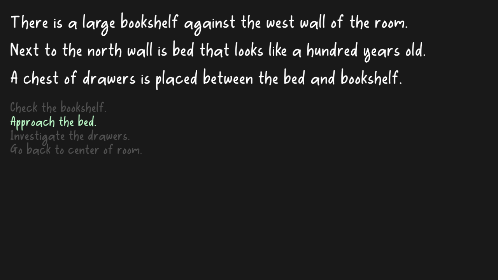

# (TODO: your game's title)

Author: (TODO: your name)

Design: (TODO: In two sentences or fewer, describe what is new and interesting about your game.)

Text Drawing: (TODO: how does the text drawing in this game work? Is text precomputed? Rendered at runtime? What files or utilities are involved?)

Screen Shot:

How To Play:

(TODO: describe the controls and (if needed) goals/strategy.)

Sources: (TODO: list a source URL for any assets you did not create yourself. Make sure you have a license for the asset.)

Really Free Font: https://www.fontspace.com/really-font-f45186
Sound:
Walking: https://freesound.org/people/13FPanska_Stranska_Michaela/sounds/378398/
Keyboard: https://freesound.org/people/Trollarch2/sounds/331656/
Open box: https://freesound.org/people/tommy_mooney/sounds/386696/
Make bed: https://freesound.org/people/Iamgiorgio/sounds/371308/
Flip book: https://freesound.org/people/Tats14/sounds/408786/
Lock open: https://freesound.org/people/fastson/sounds/399120/
Read disk: https://freesound.org/people/Anika11/sounds/325686/
Wake up: https://freesound.org/people/vanishedillusion/sounds/500618/
Drawer: https://freesound.org/people/cMilan/sounds/426769/
BGM: https://freepd.com/music/Halloween%20Theme%201.mp3
Game end: https://freepd.com/music/City%20Sunshine.mp3
Shader Program modified from: https://github.com/GenBrg/MarryPrincess/blob/master/Texture2DProgram.cpp#L81
Drawing text with OpenGL, Harfbuzz, FreeType: https://learnopengl.com/In-Practice/Text-Rendering, https://github.com/GenBrg/MarryPrincess/blob/master/DrawFont.cpp
This game was built with [NEST](NEST.md).
